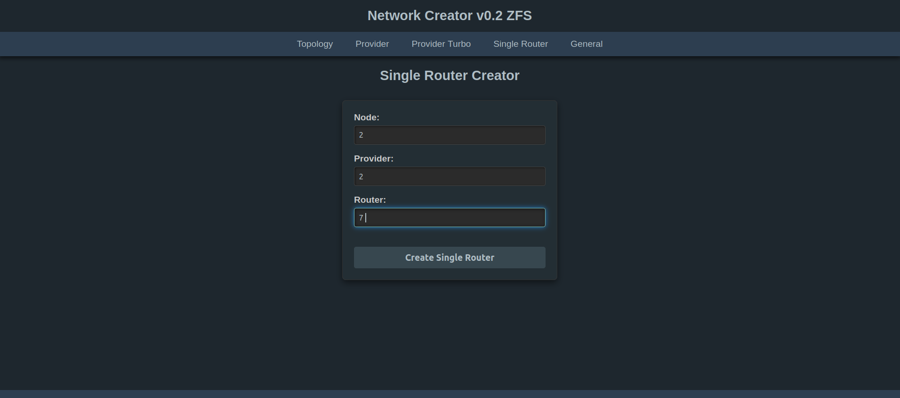

## Verwendungszwecke:

Es geht hier darum, drei Netzwerke (ISP's) bestehend aus jeweils 9 Vyos-Routern automatisiert unter PVE aufzusetzen und mit Ansible zu konfigurieren. Der Network Creator steuert eine abgewandelte Version von [aibix0001 (Gerd's) provider.sh](https://github.com/aibix0001/aasil), die darauf ausgelegt ist, sich bzgl. der Arbeitsgeschwindigkeit an die Gegebenheiten verschieden starker CPU's anzupassen: So gibt es einen Turbomodus für Rechner mit besonders starken CPU's, einen Normalmodus für schwächere CPU's und einen seriellen Modus für besonders schwache CPU's. Um den passenden Modus für die jeweils verwendete CPU zu finden, siehe den Abschnitt 'Erfahrungswerte' im Readme.pdf.
Im Readme.pdf wird außerdem beschrieben, wie der Network Creator auf Rechnern mit nur 16 GB RAM verwendet werden kann, sowie eine Menge weiterer Informationen zu seiner Arbeitsweise und Bedienung. Das [Aibix-Projekt](https://www.twitch.tv/aibix0001) wendet sich u.a. an Auszubildende und Studenten im IT-Bereich, sowie weitere Interessierte, die nicht unbedingt immer drei Kraftpakete zur Verfügung haben. Der Network Creator ist deshalb insbesondere auch zur Verwendung mit schwächeren Rechnern entwickelt worden.

## Neueinsteiger

Für alle, die mit den [Streams](https://github.com/aibix0001/streams) von Aibix nicht von Anfang an vertraut sind, gibt es anstatt des Quickstarts das Setup.pdf, in dem der Aufbau des speziellen PVE-Setup's im Einzelnen beschrieben wird, innerhalb dessen der 'streams'-Ordner mit dem Network Creator läuft.

## Quickstart

Nach dem Clonen dieses Repos den Ordner streams aus dem Ordner network_creator_v0.2_zfs herausnehmen und in den Pfad /home/user/ des PVE-Hosts ablegen und dann von da aus arbeiten.

Der Network Creator wird folgendermaßen aufgerufen:

(1) ein vyos.qcow2 Image erstellen (siehe Setup.pdf) und unter /home/user/streams/create-vms/create-vms-vyos/ ablegen,

(2) Für alle, deren User nicht user heißt: im create-vm-vyos.sh und im create-vm-vyos-turbo.sh Zeile 33 anpassen. Außerdem sind die SSH-Credentials in der Datei user-data beim Erstellen der seed.iso anzupassen, sowie die ansible.cfg 

(3) eine seed.iso erstellen (siehe Setup.pdf) und unter /var/lib/vz/template/iso ablegen,

(4) die neueste Version von Vyos rolling runterladen und unter /home/user/ansible/vyos-files/ ablegen (dazu den Ordner vyos-files anlegen). Diese Datei ab und zu aktualisieren, damit das Update auf dem neuesten Stand bleibt.

und dann eingeben:

source .venv/bin/activate

cd streams

python app.py

Nötigenfalls sudo-Password des Users im Terminal eingeben.

Der Network Creator kommt per default im Dark Mode, kann aber folgendermaßen auf Light Mode umgestellt werden:

(1) Benenne den Ordner ~/streams/static/ um in ~/streams/static_light/

(2) Benenne den Ordner ~/streams/static_dark/ um in ~/streams/static/

(3) Starte den Network Creator neu mittels  

strg+C

python app.py

## Troubleshooting

Die Warnung: 

WARNING: This is a development server. Do not use it in a production deployment. Use a production WSGI server instead.

dürfte für die Erstellung von einem Netzwerk aus 9 Routern im lokalen Bereich irrelevant sein, da der hier verwendete Server stark und sicher genug für diesen Zweck sein dürfte. Wer trotzdem einen besseren Server verwenden will kann das folgendermaßen versuchen:

Möglichkeit 1:

source .venv/bin/activate

pip install gunicorn

gunicorn -w 4 -b 0.0.0.0:8000 app:app

Möglichkeit 2:

source .venv/bin/activate

pip install uwsgi

uwsgi --http :8000 --wsgi-file app.py --callable app

Die folgenden beiden Arten von Meldungen sind irrelevant und können ignoriert werden:

unable to find configuration file for VM 101003 on node 'node1'
Configuration file 'nodes/node1/qemu-server/101003.conf' does not exist

Diese Meldung besagt, dass eine VM nicht zerstört werden konnte, weil sie nicht existiert.

[WARNING]: Platform linux on host p1r1v is using the discovered Python
interpreter at /usr/bin/python3.11, but future installation of another Python
interpreter could change the meaning of that path. See
https://docs.ansible.com/ansible-
core/2.17/reference_appendices/interpreter_discovery.html for more information.

Diese Meldung erklärt sich selbst.

Insbesondere bei schwächeren/langsameren Rechnern kann es ab und zu Timeoutprobleme geben. Dazu bitte die Datei Timeoutprobleme.pdf lesen.

